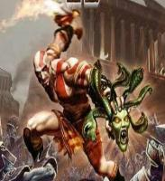
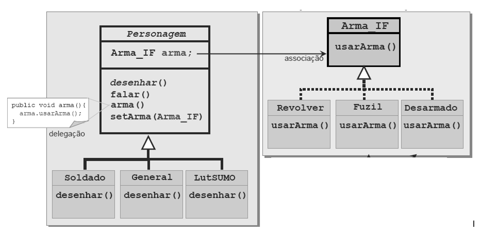
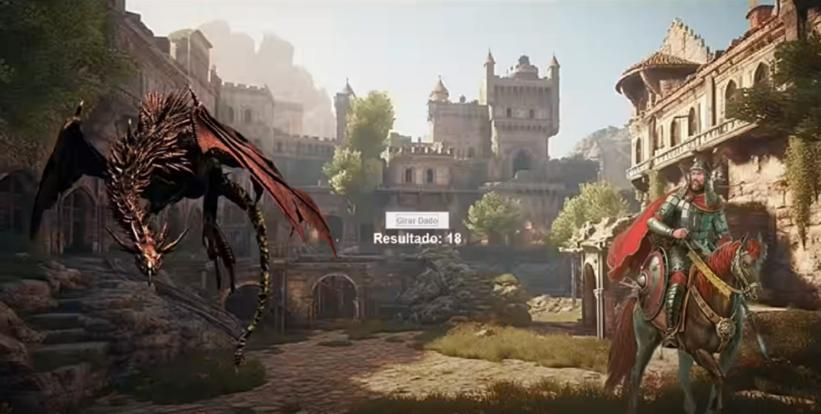

A seguir segue algumas orientações e direcionamentos iniciais do projeto
base:

Crie um projeto de nome “*JogoDesenvolvido*”. Crie inicialmente dois
pacotes, um para as armas e outro para os personagens. Estes pacotes
deverão armazenar as classes e interfaces relativas ao seu contexto.
Mais pacotes podem ser criados de acordo com a necessidade.

As seguintes funcionalidades no sistema do jogo modelado acima devem ser
incorporadas:

> a\. Inserir uma nova arma para os personagens: Faca.
>
> b\. Inseri um novo personagem Mago que consegue soltar magia como arma
> para se defender.
>
> c\. Inserir no jogo um novo personagem: DragaoAlado – verifique se
> todos os comportamentos definidos em Personagem são comuns ao dragão
> (um dragão deve falar?). Defina uma nova arma (a seu gosto) para o
> dragão (fogo, por exemplo)
>
> d\. Inserir um novo método no jogo: correr(). Este método deve
> permitir que um personagem possa correr em caso de perigo. Verifique
> se todos os personagens podem correr (ou seja, este comportamento é
> comum a todos?). Ex.: um dragão sai na carreira?
>
> e\. Inserir um novo método no jogo: voar(). Este método deve permitir
> que um personagem (em vez de correr) possa voar em caso de perigo.
> Verifique se todos os personagens são capazes de voar (ou seja, este
> comportamento é comum a todos?). Ex.: um lutador de sumô pode voar? E
> o dragão?

Crie uma classe que irá representar o jogo, contendo o método *main*.
Execute o programa fazendo testes (atribuindo e trocando armas em cada
personagem, por exemplo) e aplicando as regras de batalha, ou seja, faça
a simulação de um jogo ou combate entre os personagens utilizando as
regras definida pelo grupo. <u>Deixe explícito a contribuição que</u>
<u>o grupo acrescentou ao jogo base inicial</u>.

**Importante** **-\>** **Obrigatório**

> • Deve-se utilizar a classe InOut (*InOut.java*) para obter os dados
> via Janela de Diálogo manipulando as imagens das janelas e/ou dos
> ícones. **<u>Converse com o professor para definir melhor o escopo
> da</u>** <u>**implementação**.</u>
>
> • Deve-se utilizar recursos de tratamento de exceção em alguma parte
> do projeto. **<u>Converse com o</u>** **<u>professor para definir
> melhor o escopo da implementação</u>**
>
> • Sinta-se livre para propor melhorias, alterações, novas
> funcionalidades, por exemplo, funcionalidades como *fugir(* *),*
> *atacar(* *)* ou novos atributos, por exemplo, *dano*. **<u>Converse
> com o professor para definir melhor o</u>** **<u>escopo da
> implementação</u>**.

**DESAFIO**: Pesquise como
ter um background para o jogo, por exemplo, utilizando *JFrame*.
